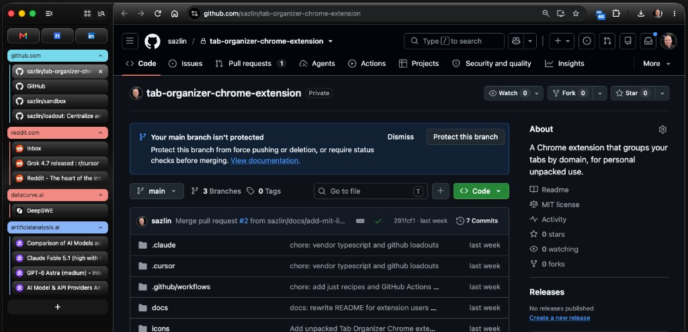
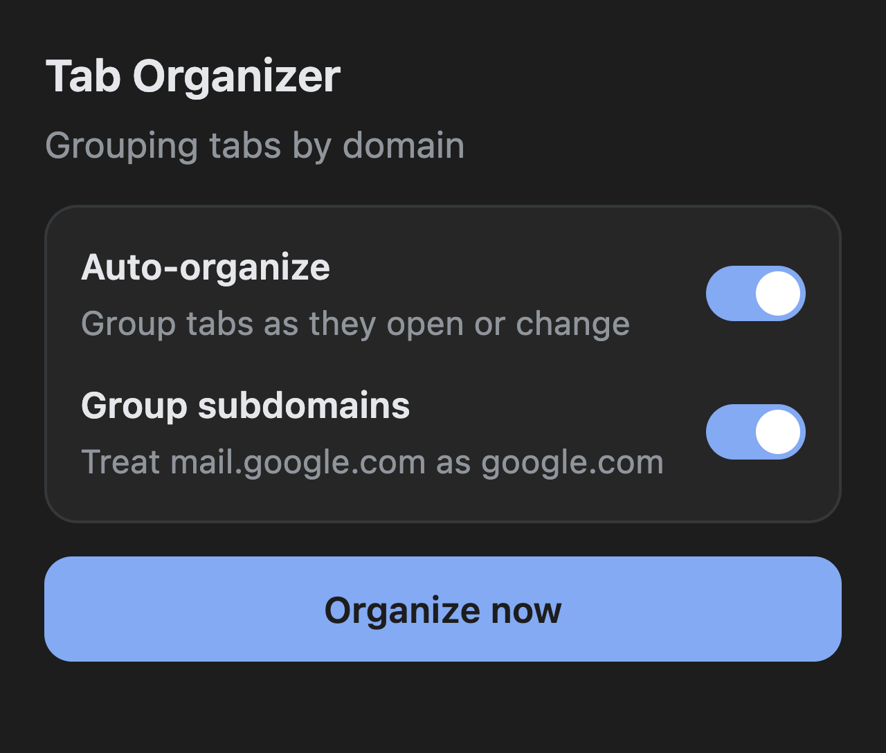

<div align="center">


# Tab Organizer

A Chrome extension that groups tabs by domain and orders tabs and groups by most recently used.

[](manifest.json)
[](LICENSE)
[](manifest.json)

</div>

<p align="center">
  
</p>

## Features

- **Groups by domain, per window.** Automatically group tabs by second-level domain, such as `github.com`, `google.com`, and `reddit.com`.
- **Recent tabs and groups float up.** Focused tabs float to the top of their group after 3 seconds. Groups float up after 30 seconds. Thresholds are configurable.
- **Special tabs get special treatment.** Pinned tabs, `chrome://` pages, and other non-http tabs stay ungrouped.
- **Stable colors and a badge.** Each domain gets a consistent group color, and the toolbar icon shows the group count.

This is for personal, unpacked use on your own machine.
It is not packaged for the Chrome Web Store.

## Installation

Requires Chrome 89 or newer.

```bash
git clone https://github.com/sazlin/tab-organizer-chrome-extension.git
```

Then load the clone as an unpacked extension:

1. Open Chrome and go to `chrome://extensions`.
2. Turn on **Developer mode** in the top-right corner.
3. Click **Load unpacked**.
4. Select this repository folder (the one that contains `manifest.json`).
5. Pin **Tab Organizer** from the puzzle-piece extensions menu if you want the popup one click away.

Chrome will prompt for the `tabs`, `tabGroups`, `storage`, and `alarms` permissions.
Those are required so the extension can read tab URLs, create groups, remember your settings, and move focused tabs after a delay.

See Chrome's [load an unpacked extension](https://developer.chrome.com/docs/extensions/get-started/tutorial/hello-world#load-unpacked) guide if the Extensions page looks different.

<details>
<summary>Maintainer setup</summary>

Requires [Homebrew](https://brew.sh) and [just](https://github.com/casey/just).

```bash
just setup
just test
```

`just setup` installs `just` and Node via the Brewfile.
`just test` runs `npm test` (Node's built-in test runner).
There is no application build; Chrome loads the source files directly.

</details>

## Configuration

The toolbar popup holds the grouping toggles, the two focus delays, and **Organize now**.

<p align="center">
  
</p>

## Quick start

Open a few tabs from the same site, or click **Organize now** in the popup.
Existing tabs are grouped when the extension is installed or when Chrome starts, as long as auto-organize is on.

If you use Incognito windows, open `chrome://extensions`, click **Details** on Tab Organizer, and enable **Allow in Incognito**.

To uninstall, click **Remove** on the Tab Organizer card at `chrome://extensions`. The extension will uninstall but tab groups will remain.

## Documentation

- [Load unpacked extensions](https://developer.chrome.com/docs/extensions/get-started/tutorial/hello-world#load-unpacked) for Chrome's install UI
- [Grouping rules](src/domain.js) for hostnames, `www.` stripping, and subdomain collapse
- [Maintainer recipes](justfile) for `just test`, CI, and loadout sync

## Contributing

Bug reports and patches are welcome via [issues](https://github.com/sazlin/tab-organizer-chrome-extension/issues) and pull requests.

## License

Licensed under the [MIT License](LICENSE).
